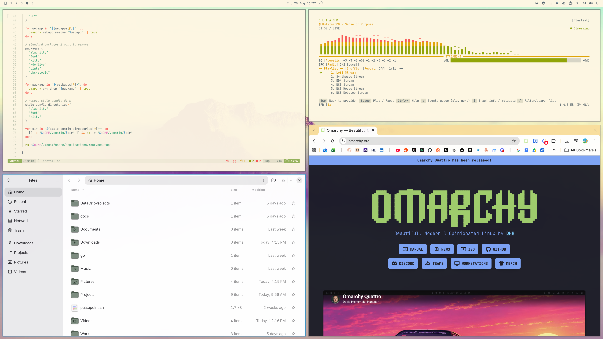

# omarchy-everforest-light

A **light-mode** port of the [Everforest](https://github.com/sainnhe/everforest) color
scheme for [Omarchy](https://omarchy.org/). Warm, soft, and green-based — designed to be
comfortable on the eyes for long working sessions.




## Everforest Light Palette

This theme implements the **Everforest Light** palette (soft, medium contrast). The
reference palette and highlighting semantics are documented upstream:

- [Everforest Color Palette](https://github.com/sainnhe/everforest/blob/master/palette.md)

### Colors

| Role | Value | Swatch |
| ------ | ------- | -------- |
| `background` | `#fdf6e3` | <span style="color:#fdf6e3">&#9608;&#9608;&#9608;</span> |
| `dark_background` | `#efebd4` | <span style="color:#efebd4">&#9608;&#9608;&#9608;</span> |
| `darker_background` | `#e6e2cc` | <span style="color:#e6e2cc">&#9608;&#9608;&#9608;</span> |
| `lighter_background` | `#f4f0d9` | <span style="color:#f4f0d9">&#9608;&#9608;&#9608;</span> |
| `foreground` | `#5c6a72` | <span style="color:#5c6a72">&#9608;&#9608;&#9608;</span> |
| `dark_foreground` | `#a6b0a0` | <span style="color:#a6b0a0">&#9608;&#9608;&#9608;</span> |
| `light_foreground` | `#829181` | <span style="color:#829181">&#9608;&#9608;&#9608;</span> |
| `accent` / `blue` | `#3a94c5` | <span style="color:#3a94c5">&#9608;&#9608;&#9608;</span> |
| `selection` | `#e6e2cc` | <span style="color:#e6e2cc">&#9608;&#9608;&#9608;</span> |
| `muted` | `#e0dcc7` | <span style="color:#e0dcc7">&#9608;&#9608;&#9608;</span> |
| `red` | `#f85552` | <span style="color:#f85552">&#9608;&#9608;&#9608;</span> |
| `orange` | `#f57d26` | <span style="color:#f57d26">&#9608;&#9608;&#9608;</span> |
| `yellow` | `#dfa000` | <span style="color:#dfa000">&#9608;&#9608;&#9608;</span> |
| `green` | `#8da101` | <span style="color:#8da101">&#9608;&#9608;&#9608;</span> |
| `cyan` | `#35a77c` | <span style="color:#35a77c">&#9608;&#9608;&#9608;</span> |
| `magenta` | `#df69ba` | <span style="color:#df69ba">&#9608;&#9608;&#9608;</span> |
| `brown` | `#7a3e13` | <span style="color:#7a3e13">&#9608;&#9608;&#9608;</span> |

The full color definitions live in [`colors.toml`](colors.toml).

## Installation

Install directly from this repository, then apply it:

```bash
omarchy theme install https://github.com/<your-user>/omarchy-everforest-light
omarchy theme set everforest-light
```

This installs the theme to `~/.config/omarchy/themes/everforest-light` and applies it
immediately. See the [Omarchy theme docs](https://omarchy.org/themes/) for more details.

## What's Included

| File | Purpose |
| ------ | --------- |
| [`colors.toml`](colors.toml) | Core color definitions for Hyprland, the shell, and GTK |
| `backgrounds/` | Included Everforest Light wallpapers |
| [`icons.theme`](icons.theme) | Icon theme (Yaru-sage) |
| [`neovim.lua`](neovim.lua) | Neovim colorscheme (LazyVim + everforest-nvim, light background) |
| [`vscode.json`](vscode.json) | VSCode/VSCodium theme (`reesew.everforest-theme`) |
| [`chromium.theme`](chromium.theme) | Chromium-based browser new-tab background color |
| `preview.png` / `preview-unlock.png` / `unlock.png` | Theme previews and lock screen art |

## Customizing

To tweak a color, copy this theme into a user theme directory and edit it:

```bash
mkdir -p ~/.config/omarchy/themes/everforest-light
cp colors.toml ~/.config/omarchy/themes/everforest-light/
# Edit ~/.config/omarchy/themes/everforest-light/colors.toml, then:
omarchy theme set everforest-light
```

## License

[MIT](LICENSE) — palette and design by [sainnhe/everforest](https://github.com/sainnhe/everforest).
